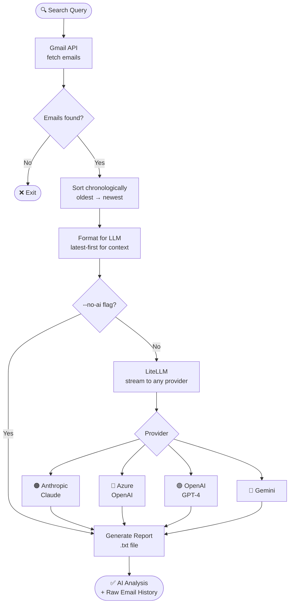

```
 ██████╗ ███╗   ███╗ █████╗ ██╗██╗      ██╗     ██╗     ███╗   ███╗
██╔════╝ ████╗ ████║██╔══██╗██║██║      ██║     ██║     ████╗ ████║
██║  ███╗██╔████╔██║███████║██║██║      ██║     ██║     ██╔████╔██║
██║   ██║██║╚██╔╝██║██╔══██║██║██║      ██║     ██║     ██║╚██╔╝██║
╚██████╔╝██║ ╚═╝ ██║██║  ██║██║███████╗███████╗███████╗██║ ╚═╝ ██║
 ╚═════╝ ╚═╝     ╚═╝╚═╝  ╚═╝╚═╝╚══════╝╚══════╝╚══════╝╚═╝     ╚═╝

 █████╗ ███╗   ██╗ █████╗ ██╗  ██╗   ██╗███████╗███████╗██████╗
██╔══██╗████╗  ██║██╔══██╗██║  ╚██╗ ██╔╝╚══███╔╝██╔════╝██╔══██╗
███████║██╔██╗ ██║███████║██║   ╚████╔╝   ███╔╝ █████╗  ██████╔╝
██╔══██║██║╚██╗██║██╔══██║██║    ╚██╔╝   ███╔╝  ██╔══╝  ██╔══██╗
██║  ██║██║ ╚████║██║  ██║███████╗██║   ███████╗███████╗██║  ██║
╚═╝  ╚═╝╚═╝  ╚═══╝╚═╝  ╚═╝╚══════╝╚═╝   ╚══════╝╚══════╝╚═╝  ╚═╝
```

<div align="center">

**Search your Gmail. Let an LLM tell you the story.**

[](https://python.org)
[](https://docs.litellm.ai)
[](https://developers.google.com/gmail/api)
[](https://anthropic.com)
[](LICENSE)

</div>

---

## What it does

```
┌─────────────────────────────────────────────────────────────────┐
│                                                                 │
│   $ python gmail_analyzer.py "vendor contract renewal"         │
│                                                                 │
│   Searching: 'vendor contract renewal'                         │
│   Fetched 24 / 24 ✓                                            │
│   Sending to anthropic/claude-opus-4-7 for analysis...         │
│                                                                 │
│   ## How it started                                             │
│   On March 3rd, Alice initiated the renewal process by...      │
│                                                                 │
│   ## Key decisions                                              │
│   The legal team approved revised terms on April 2nd...        │
│                                                                 │
│   ## Current status                                             │
│   Awaiting sign-off from finance. Action item: follow up...    │
│                                                                 │
│   Report saved → report_vendor_contract_renewal.txt            │
│                                                                 │
└─────────────────────────────────────────────────────────────────┘
```

---

## How it works



---

## Architecture

```
┌──────────────────────────────────────────────────────────────┐
│                      gmail_analyzer.py                       │
│                                                              │
│  ┌──────────────┐    ┌──────────────┐    ┌───────────────┐  │
│  │  Gmail Auth  │    │ Email Fetch  │    │  LLM Analyse  │  │
│  │              │    │              │    │               │  │
│  │ credentials  │───▶│  query +     │───▶│  latest-first │  │
│  │ .json        │    │  date range  │    │  → narrative  │  │
│  │ token.json   │    │  max results │    │  → streaming  │  │
│  └──────────────┘    └──────────────┘    └───────┬───────┘  │
│                                                  │          │
│                                          ┌───────▼───────┐  │
│                                          │ Report (.txt) │  │
│                                          │               │  │
│                                          │ AI Analysis   │  │
│                                          │ ─────────     │  │
│                                          │ Raw Emails    │  │
│                                          └───────────────┘  │
└──────────────────────────────────────────────────────────────┘
         │                                        │
         ▼                                        ▼
  Google Cloud                             LiteLLM Router
  Gmail API                          ┌─────────────────────┐
                                     │  anthropic / azure  │
                                     │  openai  / gemini   │
                                     │  + 100 more...      │
                                     └─────────────────────┘
```

---

## Supported LLM Providers

```
╔══════════════════╦═══════════════════════════════╦═══════════════════════════════════════════╗
║ Provider         ║ --model string                ║ Required env vars                         ║
╠══════════════════╬═══════════════════════════════╬═══════════════════════════════════════════╣
║ 🟠 Anthropic     ║ anthropic/claude-opus-4-7     ║ ANTHROPIC_API_KEY                         ║
║                  ║ anthropic/claude-sonnet-4-6   ║                                           ║
╠══════════════════╬═══════════════════════════════╬═══════════════════════════════════════════╣
║ 🔵 Azure OpenAI  ║ azure/<deployment-name>       ║ AZURE_API_KEY                             ║
║                  ║                               ║ AZURE_API_BASE                            ║
║                  ║                               ║ AZURE_API_VERSION                         ║
╠══════════════════╬═══════════════════════════════╬═══════════════════════════════════════════╣
║ 🟢 OpenAI        ║ openai/gpt-4o                 ║ OPENAI_API_KEY                            ║
║                  ║ openai/gpt-4-turbo            ║                                           ║
╠══════════════════╬═══════════════════════════════╬═══════════════════════════════════════════╣
║ 🔴 Google Gemini ║ gemini/gemini-1.5-pro         ║ GEMINI_API_KEY                            ║
╚══════════════════╩═══════════════════════════════╩═══════════════════════════════════════════╝
```

Any [LiteLLM-supported provider](https://docs.litellm.ai/docs/providers) works — 100+ models.

---

## Setup

### Step 1 — Install dependencies

```bash
pip install -r requirements.txt
```

### Step 2 — Gmail API credentials

```
  Google Cloud Console
  ┌─────────────────────────────────────────────┐
  │  1. Create / select a project               │
  │  2. APIs & Services → Enable Gmail API      │
  │  3. Credentials → OAuth 2.0 Client ID       │
  │     Application type: Desktop App           │
  │  4. Download JSON → rename credentials.json │
  │  5. Place in same folder as the script      │
  │  6. OAuth consent screen → Test users       │
  │     → add your Gmail address                │
  └─────────────────────────────────────────────┘
  👆 console.cloud.google.com
```

On **first run** a browser window opens for Google sign-in. A `token.json` is saved for all future runs.

### Step 3 — Set your LLM API key

```bash
# Windows
set ANTHROPIC_API_KEY=sk-ant-...

# Mac / Linux
export ANTHROPIC_API_KEY=sk-ant-...
```

---

## Usage

```
usage: gmail_analyzer.py [-h] [--max N] [--after YYYY/MM/DD] [--before YYYY/MM/DD]
                         [--model MODEL] [--output FILE] [--no-ai]
                         query

positional arguments:
  query              Gmail search term

options:
  --max N            Max emails to fetch        (default: 100)
  --after YYYY/MM/DD Only emails after date
  --before YYYY/MM/DD Only emails before date
  --model MODEL, -m  LLM model string           (default: anthropic/claude-opus-4-7)
  --output FILE, -o  Output filename
  --no-ai            Skip AI analysis, raw report only
```

### Examples

```bash
# ── Basic search ──────────────────────────────────────────────
python gmail_analyzer.py "budget approval"

# ── With date range ───────────────────────────────────────────
python gmail_analyzer.py "project renewal" --after 2024/01/01 --before 2024/12/31

# ── Azure OpenAI ──────────────────────────────────────────────
set AZURE_API_KEY=...
set AZURE_API_BASE=https://your-resource.openai.azure.com/
set AZURE_API_VERSION=2024-02-01
python gmail_analyzer.py "vendor contract" --model azure/gpt-4o

# ── OpenAI ────────────────────────────────────────────────────
set OPENAI_API_KEY=sk-...
python gmail_analyzer.py "onboarding" --model openai/gpt-4o

# ── Raw report only (no LLM) ──────────────────────────────────
python gmail_analyzer.py "invoice" --no-ai

# ── Custom output + high volume ───────────────────────────────
python gmail_analyzer.py "Walmart" --max 200 --output walmart_history.txt
```

---

## Report structure

```
════════════════════════════════════════════════════════════════════════
  GMAIL EMAIL ANALYSIS REPORT
  Query     : vendor contract renewal
  Model     : anthropic/claude-opus-4-7
  Generated : 2026-04-18 14:30
  Emails    : 24
════════════════════════════════════════════════════════════════════════

  AI ANALYSIS
  ────────────────────────────────────────────────────────────────────

  ## How it started
  On March 3rd, Alice initiated the renewal...

  ## Key decisions
  Legal approved revised terms on April 2nd...

  ## Current status & open items
  Awaiting sign-off from finance. Bob to follow up by Friday.

════════════════════════════════════════════════════════════════════════

  RAW EMAIL HISTORY (chronological)
  ────────────────────────────────────────────────────────────────────

  ── March 2024 ────────────────────────────────────────────────────

[1]  2024-03-03  09:14
  From    : alice@company.com
  To      : bob@company.com
  Subject : Contract renewal — action needed
  ────────────────────────────────────────────────────────────────────
  Hi Bob, the vendor contract expires on April 30th...

  ...

════════════════════════════════════════════════════════════════════════
  END OF REPORT — 24 emails matched 'vendor contract renewal'
════════════════════════════════════════════════════════════════════════
```

---

## File structure

```
gmail-analyzer/
├── gmail_analyzer.py     ← main script
├── requirements.txt      ← dependencies
├── .gitignore            ← credentials & tokens excluded
├── README.md
│
├── credentials.json      ← YOU provide (not committed)
├── token.json            ← auto-generated  (not committed)
└── report_*.txt          ← generated reports (not committed)
```

---

## Security

```
  ✅  gmail.readonly scope — read-only Gmail access, no write/send
  ✅  credentials.json and token.json in .gitignore
  ✅  report_*.txt files excluded from git
  ✅  API keys read from environment variables only — never hardcoded
```

---

## Requirements

- Python 3.8+
- Google account with Gmail
- API key for your chosen LLM provider

---

<div align="center">
Built with the Gmail API · LiteLLM · Anthropic Claude
</div>
